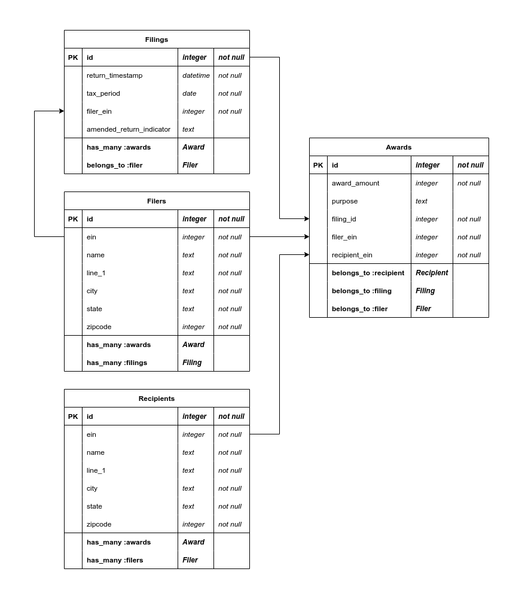
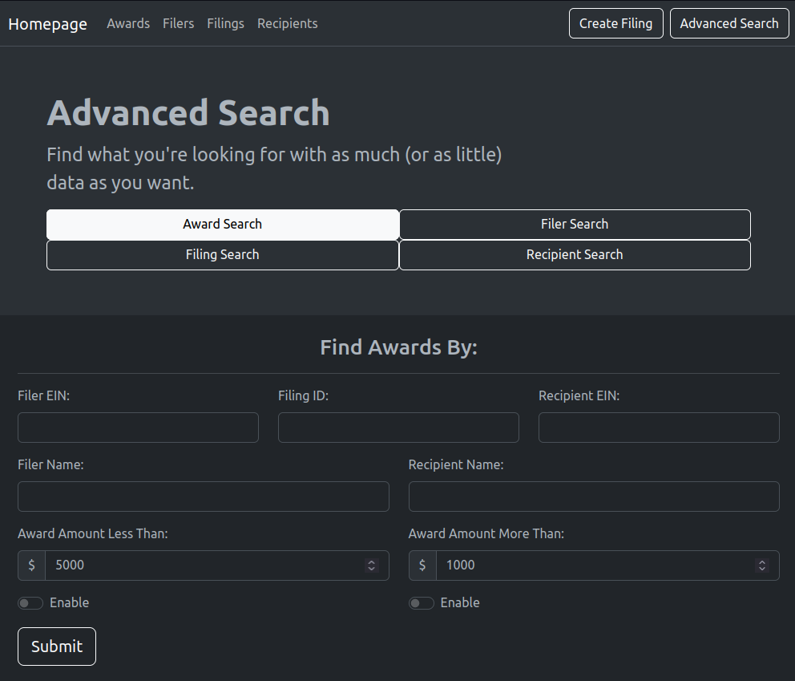
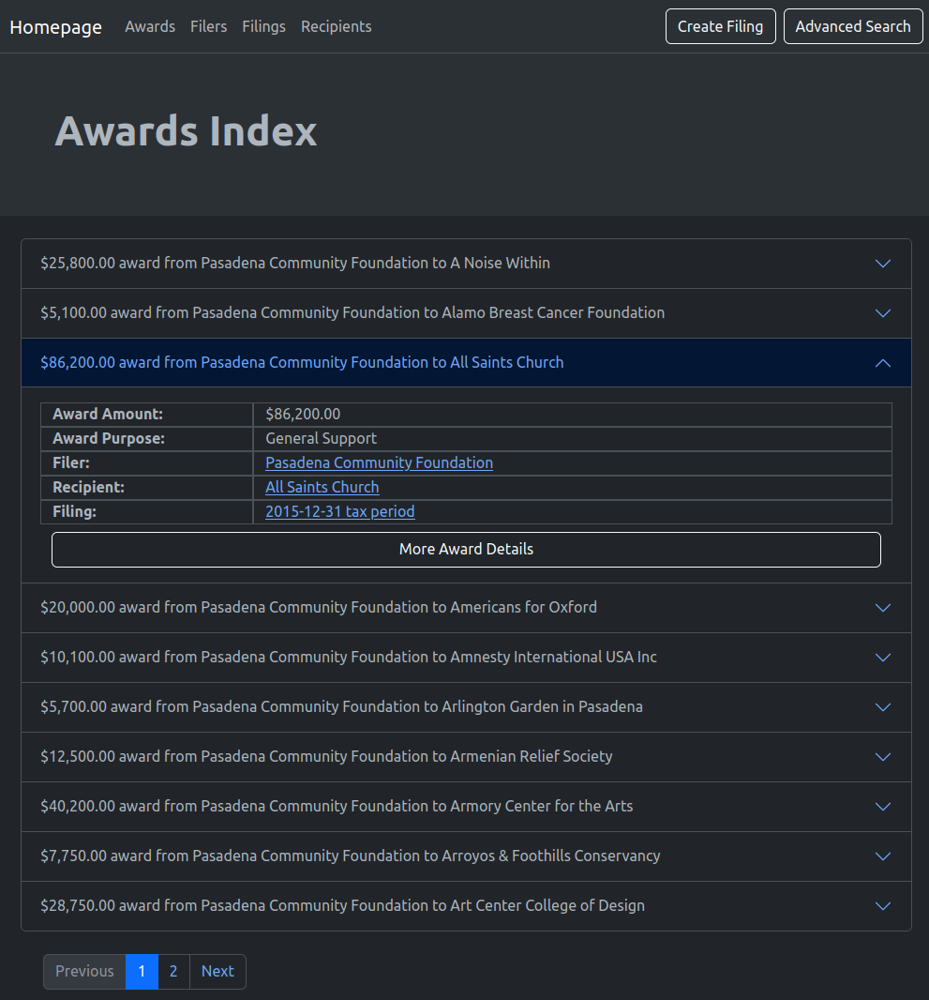
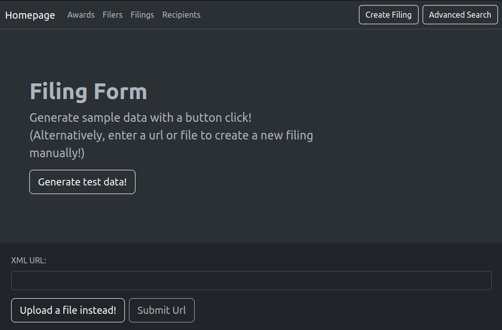

  

  <i>Turn your data into bite-sized pieces!</i>

---

> **Production Link:** https://filings-navigator.herokuapp.com

# 1. Table of Contents
- [1. Table of Contents](#1-table-of-contents)
- [2. Installation](#2-installation)
  - [2.1. Install gems](#21-install-gems)
  - [2.2. Prepare DB](#22-prepare-db)
  - [2.3. Running the server](#23-running-the-server)
  - [2.4. Running the frontend](#24-running-the-frontend)
- [3. High-Level Description](#3-high-level-description)
- [4. Backend architecture](#4-backend-architecture)
  - [4.1. Backend design schema diagram:](#41-backend-design-schema-diagram)
  - [4.2. Awards `GET` `/api/awards?paramKey=paramValue`](#42-awards-get-apiawardsparamkeyparamvalue)
  - [4.3. Filers `GET` `/api/filers?paramKey=paramValue`](#43-filers-get-apifilersparamkeyparamvalue)
  - [4.4. Filings `GET` `/api/filings?paramKey=paramValue`](#44-filings-get-apifilingsparamkeyparamvalue)
  - [4.5. Recipients `GET` `/api/recipients?paramKey=paramValue`](#45-recipients-get-apirecipientsparamkeyparamvalue)
- [5. Screenshots](#5-screenshots)
  - [5.1. Advanced Search](#51-advanced-search)
  - [5.2. Awards Index](#52-awards-index)
  - [5.3. Filing Form](#53-filing-form)
  - [5.4. Filer Page](#54-filer-page)
- [6. Future Improvements](#6-future-improvements)

# 2. Installation

## 2.1. Install gems

- `bundle install`

## 2.2. Prepare DB

- `rake db:migrate`

## 2.3. Running the server

- `rails s`

## 2.4. Running the frontend

- `cd frontend`
- `npm install`
- `npm run dev`

# 3. High-Level Description

> The _Filings Navigator_ is an advanced full-stack application built on Ruby on Rails and Typescript Next.js that allows users to better manage their tax filings and associated data in a navigable format.

It has advanced search functions that are built on a performant parameterized SQL query backend and are delivered using cached RTK Queries handled by a Redux store integrated into Next.js.

Each of the frontend routes are passed through a page building model that renders functional hook-based React components.

# 4. Backend architecture

## 4.1. Backend design schema diagram:

## 4.2. Awards `GET` `/api/awards?paramKey=paramValue`

| Query Parameter    | Required | Description                                                                  |
| ------------------ | -------- | ---------------------------------------------------------------------------- |
| `page`             | true     | Returns the given page from the paginated awards                             |
| `filing_id`        | false    | Filter awards based on the associated filing id                              |
| `filer_ein`        | false    | Filter awards based on the EIN (Employer Identification Number) of the filer |
| `filer_name`       | false    | Filter awards based on the name of the filer                                 |
| `recipient_ein`    | false    | Filter awards based on the EIN of the recipient                              |
| `recipient_name`   | false    | Filter awards based on the name of the recipient                             |
| `amount_more_than` | false    | Filter awards with an amount greater than the specified value                |
| `amount_less_than` | false    | Filter awards with an amount less than the specified value                   |

## 4.3. Filers `GET` `/api/filers?paramKey=paramValue`

| Query Parameter     | Required | Description                                                              |
| ------------------- | -------- | ------------------------------------------------------------------------ |
| `ein`               | false    | Filter filers based on the EIN (Employer Identification Number)          |
| `name`              | false    | Filter filers based on the name                                          |
| `city`              | false    | Filter filers based on the city                                          |
| `state`             | false    | Filter filers based on the state                                         |
| `more_filings_than` | false    | Filter filers with more filings than the specified value                 |
| `less_filings_than` | false    | Filter filers with less filings than the specified value                 |
| `more_awards_than`  | false    | Filter filers with more awards than the specified value                  |
| `less_awards_than`  | false    | Filter filers with less awards than the specified value                  |
| `awarded_more_than` | false    | Filter filers with a total award amount greater than the specified value |
| `awarded_less_than` | false    | Filter filers with a total award amount less than the specified value    |

## 4.4. Filings `GET` `/api/filings?paramKey=paramValue`

| Query Parameter     | Required | Description                                                                   |
| ------------------- | -------- | ----------------------------------------------------------------------------- |
| `filer_ein`         | false    | Filter filings based on the EIN (Employer Identification Number) of the filer |
| `filer_name`        | false    | Filter filings based on the name of the filer                                 |
| `more_awards_than`  | false    | Filter filings with more awards than the specified value                      |
| `less_awards_than`  | false    | Filter filings with less awards than the specified value                      |
| `awarded_more_than` | false    | Filter filings with a total award amount greater than the specified value     |
| `awarded_less_than` | false    | Filter filings with a total award amount less than the specified value        |

## 4.5. Recipients `GET` `/api/recipients?paramKey=paramValue`

| Query Parameter     | Required | Description                                                                                                |
| ------------------- | -------- | ---------------------------------------------------------------------------------------------------------- |
| `ein`               | false    | Filter recipients based on the EIN (Employer Identification Number)                                        |
| `name`              | false    | Filter recipients based on the name                                                                        |
| `city`              | false    | Filter recipients based on the city                                                                        |
| `state`             | false    | Filter recipients based on the state                                                                       |
| `more_awards_than`  | false    | Filter recipients with more awards than the specified value                                                |
| `less_awards_than`  | false    | Filter recipients with less awards than the specified value                                                |
| `awarded_more_than` | false    | Filter recipients with a total award amount greater than the specified value                               |
| `awarded_less_than` | false    | Filter recipients with a total award amount less than the specified value                                  |
| `awarded_by_name`   | false    | Filter recipients based on the name of the filer who awarded them an award                                 |
| `awarded_by_ein`    | false    | Filter recipients based on the EIN of the filer who awarded them an award (Employer Identification Number) |

# 5. Screenshots
The following set of screenshots are not comprehensive. All pages are fully interactive, functional, and powered by corresponding backend api's that execute paginated database queries.

## 5.1. Advanced Search

## 5.2. Awards Index

## 5.3. Filing Form

## 5.4. Filer Page

# 6. Future Improvements
- OAuth authentication (login with Google, Apple, etc...)
- Design system improvements
- Hosting (CI/CD with Heroku and Github Actions)
- Security improvements for id parameters (non-sequential ids)
- Additional searches involving similar strings (non-identical queries)
- API and frontend testing / validation
- Renaming and reorganizing components to be even more modular and DRY
- Linting
